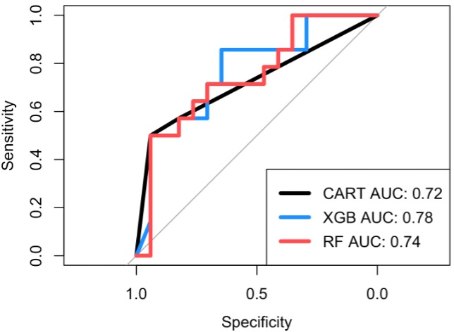
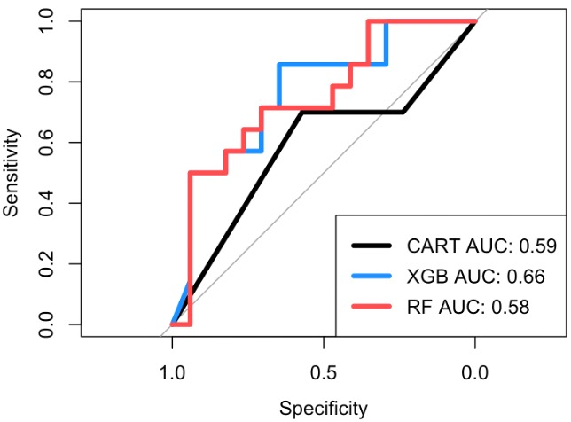
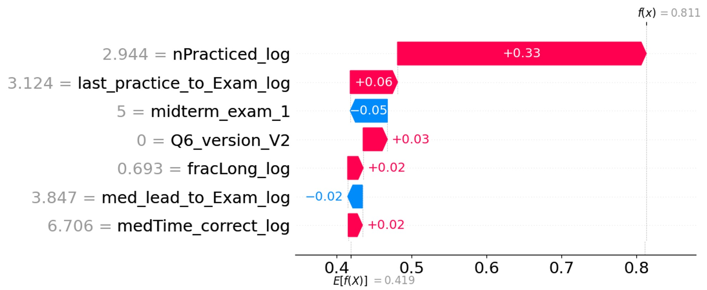
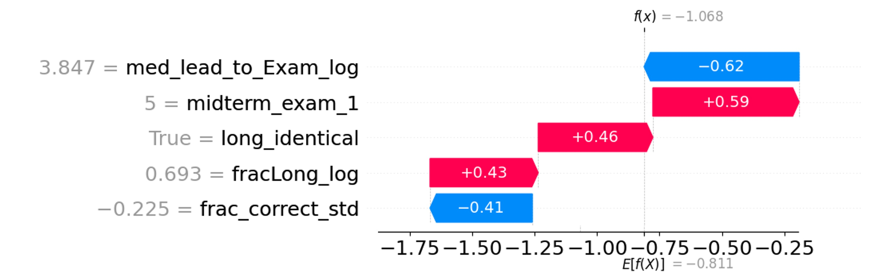
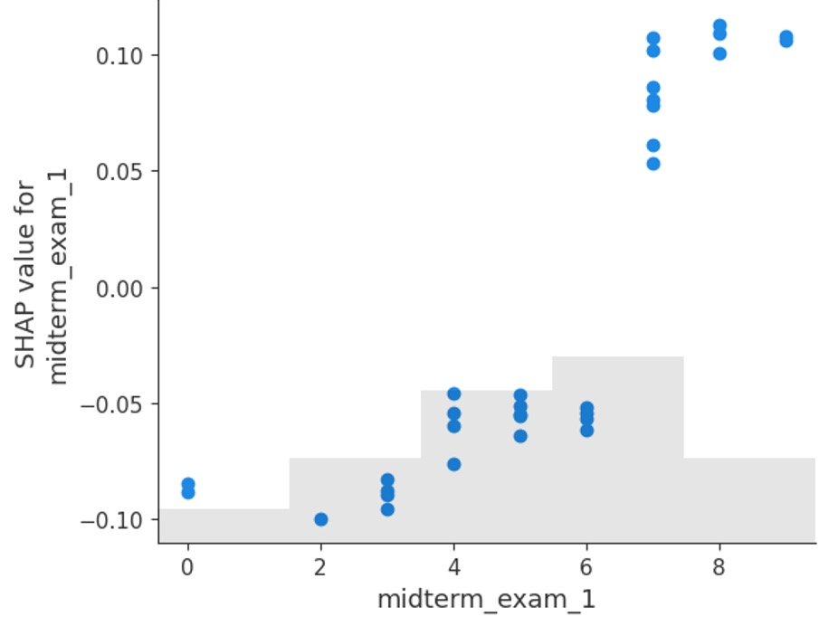
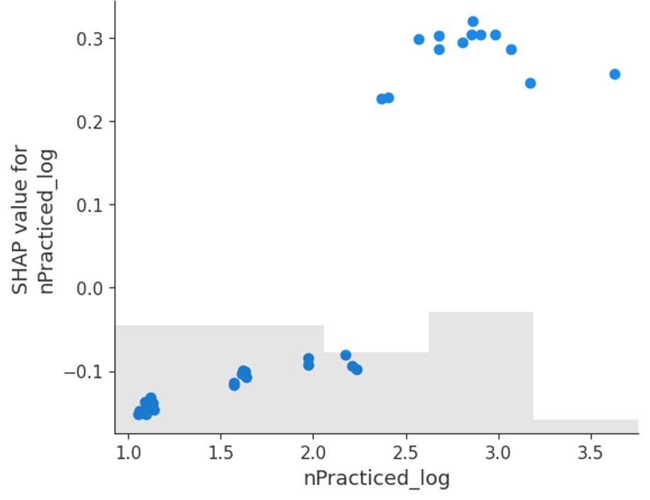
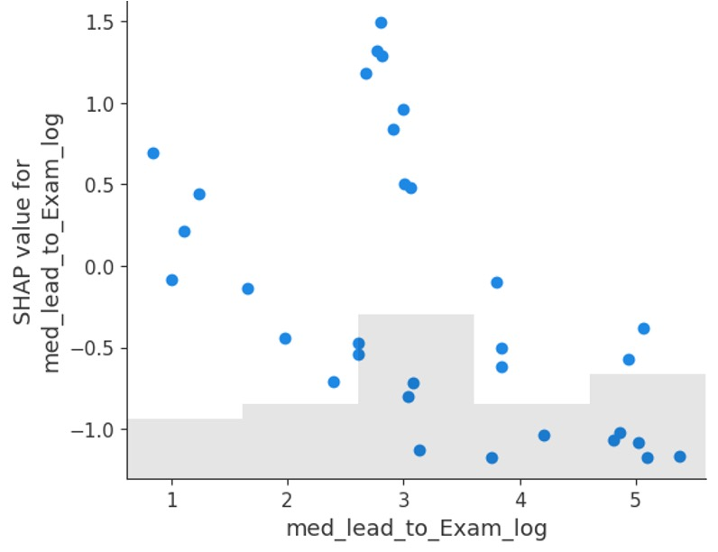
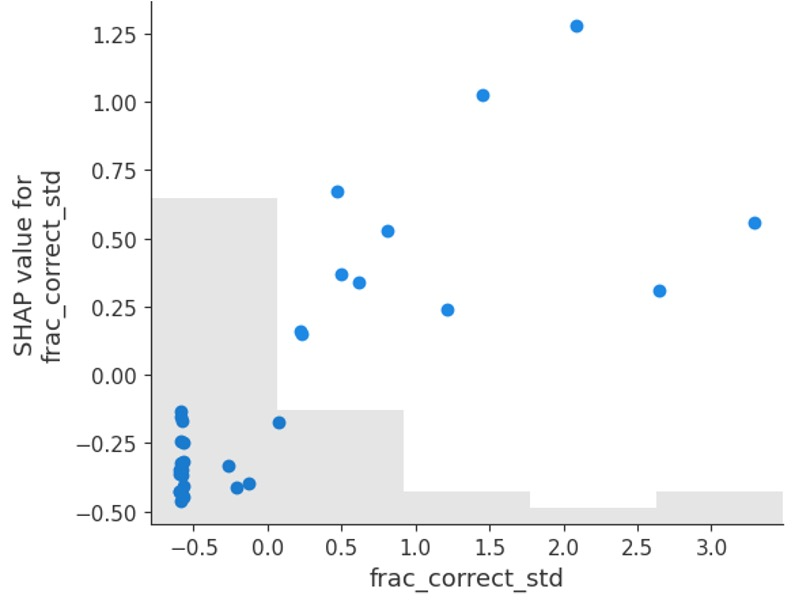

# Towards Actionable Recommendations for Exam Preparation Using Isomorphic Problem Banks and Explanatory Machine Learning
 
The goal of this project is to enhance exam preparation strategies by leveraging isomorphic problem banks and explainable machine learning techniques.

## Code Path
This repository includes both R scripts and a Python notebook to support predictive modeling and model interpretability.

### 1. Predictive Analysis in R
These scripts perform feature importance analysis using machine learning models on both original and transfer problem settings.

```R
# Run feature importance analysis for the Original Problem
source("code/Feature_Importance.R")

# Run feature importance analysis for the Transfer Problem
source("code/Feature_Importance_transfer.R")

```

### 2. SHAP-Based Explainability in Python
This Jupyter notebook applies SHAP (SHapley Additive exPlanations) to visualize and interpret the most influential features in the best-performing machine learning model.
```bash
jupyter notebook code/SHAP.ipynb
```

## Requirements
R packages:
```R
randomForest
xgboost
DALEX
caret
```
Python packages:
```bash
pip install shap xgboost pandas scikit-learn matplotlib
```

## Repository Structure
```bash
├── code/
│   ├── Feature_Importance.R           # R script for original model feature importance
│   ├── Feature_Importance_transfer.R  # R script for transfer model analysis
│   └── SHAP.ipynb                     # Jupyter notebook for SHAP analysis
├── data/
│   ├── original_outcome_data.csv      # Main training dataset
│   └── transfer_outcome_data.csv      # Dataset for transfer learning evaluation
├── results/                           # plots
├── README.md                          # Project documentation
```

## Visualizations

### ROC Curves

- **Figure 1(A):** ROC Curve – Original Model  
  

- **Figure 1(B):** ROC Curve – Transfer Model  
  

---

### Feature Importance (SHAP)

- **Figure 2(A):** SHAP Feature Importance – Original Model  
  

- **Figure 2(B):** SHAP Feature Importance – Transfer Model  
  

---

### SHAP Force Plots

- **Figure 3(A):** SHAP Force Plot – Midterm Feature  
  

- **Figure 3(B):** SHAP Force Plot – Practice Frequency Feature  
  

- **Figure 4(A):** SHAP Force Plot – Med-to-Exam Time Feature  
  

- **Figure 4(B):** SHAP Force Plot – Correct Fraction Feature  
  

